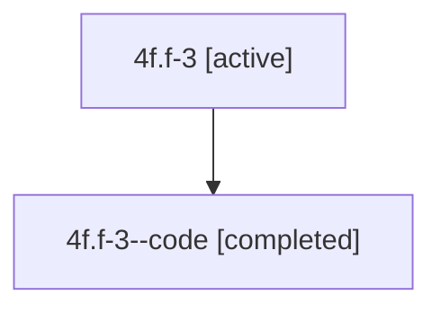

# Family: 4f.f-3

[Agent Hoods](../README.md) / [bbugyi200](../users/bbugyi200/README.md) / [athena](../users/bbugyi200/machines/athena/README.md) / [4f](../users/bbugyi200/machines/athena/hoods/4f/README.md) / 4f.f-3

Owner: `bbugyi200.athena` · Hood: `4f` · Members: 2

## Lineage

The diagram is an optional enhancement; the ordered table below contains the same lineage in accessible text.

| Role | Agent | State | Model / provider | Timing | Commits | Prompt | Chat |
|---|---|---|---|---|---:|---|---|
| root | 4f.f-3 | active | claude-fable-5 / claude | 2026-07-10T16:49:08.605060+00:00 | [1](../agents/bbugyi200.athena.4f.f-3/README.md#commits) | [Prompt](../agents/bbugyi200.athena.4f.f-3/prompt.md) | [Chat](../agents/bbugyi200.athena.4f.f-3/chat.md) |
| code | 4f.f-3--code | completed | gpt-5.6-sol / codex | 2026-07-10T16:59:33.146105+00:00 | 0 | — | [Chat](../agents/bbugyi200.athena.4f.f-3--code/chat.md) |

## Commits

| Role | Commit | Subject | Committed (UTC) |
|---|---|---|---|
| root | [`d0c4f88`](https://github.com/sase-org/sase/commit/d0c4f8838b3e7a1cbdfde32230d5c04170dd3e71) | fix(vcs): exclude phantom repositories from global inventory | 2026-07-10 17:09:28 |

## Neighbors

| Agent | Relation | State |
|---|---|---|
| [4f](bbugyi200.athena.4f.md) (family · 2) | ancestor | active 1, completed 1 |
| [4f.f-0](../agents/bbugyi200.athena.4f.f-0/README.md) | 4f hood | active |
| [4f.f-1](../agents/bbugyi200.athena.4f.f-1/README.md) | 4f hood | active |
| [4f.f-2](../agents/bbugyi200.athena.4f.f-2/README.md) | 4f hood | active |
| [4f.f1](../agents/bbugyi200.athena.4f.f1/README.md) | 4f hood | completed |
| [4f.f1.f1](../agents/bbugyi200.athena.4f.f1.f1/README.md) | 4f hood | completed |
