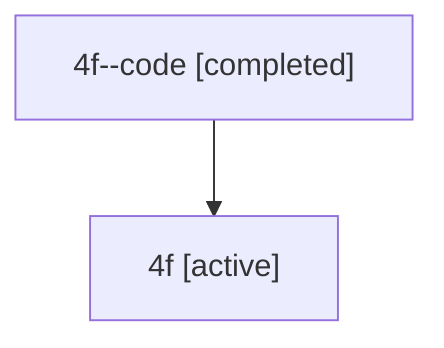

# Family: 4f

Owner: `bbugyi200.athena` · Hood: `4f` · Members: 2

## Lineage

The diagram is an optional enhancement; the ordered table below contains the same lineage in accessible text.

| Role | Agent | State | Model / provider | Timing | Commits | Prompt | Chat |
|---|---|---|---|---|---:|---|---|
| code | 4f--code | completed | gpt-5.6-sol / codex | 2026-07-10T14:51:51.993726+00:00 | 0 | — | [Chat](../agents/bbugyi200.athena.4f--code/chat.md) |
| root | 4f | active | gpt-5.6-sol / codex | 2026-07-10T14:46:59.951799+00:00 | 2 | [Prompt](../agents/bbugyi200.athena.4f/prompt.md) | [Chat](../agents/bbugyi200.athena.4f/chat.md) |
