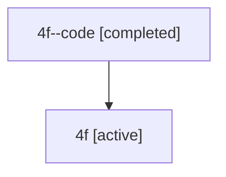

# Family: 4f

[Agent Hoods](../README.md) / [bbugyi200](../users/bbugyi200/README.md) / [athena](../users/bbugyi200/machines/athena/README.md) / [4f](../users/bbugyi200/machines/athena/hoods/4f/README.md) / 4f

Owner: `bbugyi200.athena` · Hood: `4f` · Members: 2

## Lineage

The diagram is an optional enhancement; the ordered table below contains the same lineage in accessible text.

| Role | Agent | State | Model / provider | Timing | Commits | Prompt | Chat |
|---|---|---|---|---|---:|---|---|
| code | 4f--code | completed | gpt-5.6-sol / codex | 2026-07-10T14:51:51.993726+00:00 | [1](../agents/bbugyi200.athena.4f--code/README.md#commits) | — | [Chat](../agents/bbugyi200.athena.4f--code/chat.md) |
| root | 4f | active | gpt-5.6-sol / codex | 2026-07-10T14:46:59.951799+00:00 | 0 | [Prompt](../agents/bbugyi200.athena.4f/prompt.md) | [Chat](../agents/bbugyi200.athena.4f/chat.md) |

## Commits

| Role | Repo | Commit | Subject | Committed |
|---|---|---|---|---|
| — | sase | [`b6b4a7a`](https://github.com/sase-org/sase/commit/b6b4a7a730600863ca2d1a6913d1f69e9db98d8b) | chore: Add SDD prompt and plan for sase\_telegram\_pypi\_release | 2026-06-09 16:03:08 EDT |
| code | sase | [`cebc837`](https://github.com/sase-org/sase/commit/cebc837720036c1dae660bcacf3f7f4f37006378) | feat(vcs)!: add all-project commit log scope | 2026-07-10 11:08:33 EDT |

## Neighbors

| Agent | Relation | State |
|---|---|---|
| [4f.f-0](../agents/bbugyi200.athena.4f.f-0/README.md) | descendant | active |
| [4f.f-1](../agents/bbugyi200.athena.4f.f-1/README.md) | descendant | active |
| [4f.f-2](../agents/bbugyi200.athena.4f.f-2/README.md) | descendant | active |
| [4f.f-3](bbugyi200.athena.4f.f-3.md) (family · 2) | descendant | active 1, completed 1 |
| [4f.f1](../agents/bbugyi200.athena.4f.f1/README.md) | descendant | completed |
| [4f.f1.f1](../agents/bbugyi200.athena.4f.f1.f1/README.md) | descendant | completed |
