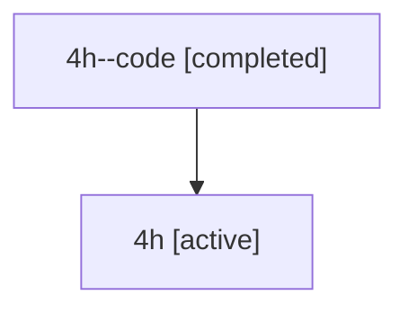

# Family: 4h

Owner: `bbugyi200.athena` · Hood: `4h` · Members: 2

## Lineage

The diagram is an optional enhancement; the ordered table below contains the same lineage in accessible text.

| Role | Agent | State | Model / provider | Timing | Commits | Prompt | Chat |
|---|---|---|---|---|---:|---|---|
| code | 4h--code | completed | gpt-5.6-sol / codex | 2026-07-10T15:19:55.884906+00:00 | 0 | — | [Chat](../agents/bbugyi200.athena.4h--code/chat.md) |
| root | 4h | active | gpt-5.6-sol / codex | 2026-07-10T15:16:09.985288+00:00 | 1 | [Prompt](../agents/bbugyi200.athena.4h/prompt.md) | [Chat](../agents/bbugyi200.athena.4h/chat.md) |
