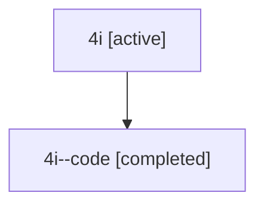

# Family: 4i

[Agent Hoods](../README.md) / [bbugyi200](../users/bbugyi200/README.md) / [athena](../users/bbugyi200/machines/athena/README.md) / [4i](../users/bbugyi200/machines/athena/hoods/4i/README.md) / 4i

Owner: `bbugyi200.athena` · Hood: `4i` · Members: 2

## Lineage

The diagram is an optional enhancement; the ordered table below contains the same lineage in accessible text.

| Role | Agent | State | Model / provider | Timing | Commits | Prompt | Chat |
|---|---|---|---|---|---:|---|---|
| root | 4i | active | gpt-5.6-sol / codex | 2026-07-10T15:17:30.276768+00:00 | [3](../agents/bbugyi200.athena.4i/README.md#commits) | [Prompt](../agents/bbugyi200.athena.4i/prompt.md) | [Chat](../agents/bbugyi200.athena.4i/chat.md) |
| code | 4i--code | completed | gpt-5.6-sol / codex | 2026-07-10T15:21:11.267558+00:00 | 0 | — | [Chat](../agents/bbugyi200.athena.4i--code/chat.md) |

## Commits

| Role | Commit | Subject | Committed (UTC) |
|---|---|---|---|
| root | [`a141201`](https://github.com/sase-org/sase/commit/a141201cf038db63d1c4bf84d87d87e037cfadbc) | chore: Add SDD prompt and plan for cli\_help\_output | 2026-06-09 22:15:19 |
| root | [`3161450`](https://github.com/sase-org/sase/commit/3161450fc57f1db9f677ad98ac81d1504691b416) | feat: add compact root CLI help | 2026-06-09 22:24:52 |
| root | [`8d2179c`](https://github.com/sase-org/sase/commit/8d2179ced988a670782773751ec7c6c0858c6f5f) | fix(xprompt): preserve time-shaped wait dependency names | 2026-07-10 15:28:11 |
