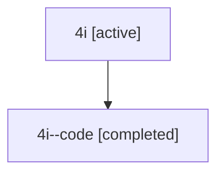

# Family: 4i

Owner: `bbugyi200.athena` · Hood: `4i` · Members: 2

## Lineage

The diagram is an optional enhancement; the ordered table below contains the same lineage in accessible text.

| Role | Agent | State | Model / provider | Timing | Commits | Prompt | Chat |
|---|---|---|---|---|---:|---|---|
| root | 4i | active | gpt-5.6-sol / codex | 2026-07-10T15:17:30.276768+00:00 | 3 | [Prompt](../agents/bbugyi200.athena.4i/prompt.md) | [Chat](../agents/bbugyi200.athena.4i/chat.md) |
| code | 4i--code | completed | gpt-5.6-sol / codex | 2026-07-10T15:21:11.267558+00:00 | 0 | — | [Chat](../agents/bbugyi200.athena.4i--code/chat.md) |
