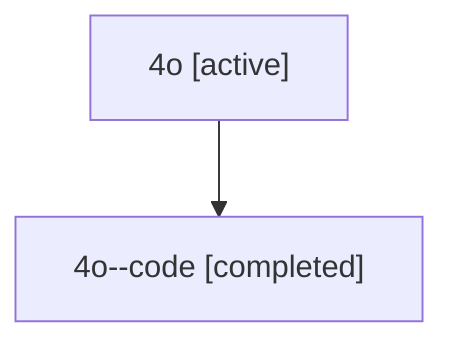

# Family: 4o

[Agent Hoods](../README.md) / [bbugyi200](../users/bbugyi200/README.md) / [athena](../users/bbugyi200/machines/athena/README.md) / [4o](../users/bbugyi200/machines/athena/hoods/4o/README.md) / 4o

Owner: `bbugyi200.athena` · Hood: `4o` · Members: 2

## Lineage

The diagram is an optional enhancement; the ordered table below contains the same lineage in accessible text.

| Role | Agent | State | Model / provider | Timing | Commits | Prompt | Chat |
|---|---|---|---|---|---:|---|---|
| root | 4o | active | claude-fable-5 / claude | 2026-07-10T19:09:30.590363+00:00 | 0 | [Prompt](../agents/bbugyi200.athena.4o/prompt.md) | [Chat](../agents/bbugyi200.athena.4o/chat.md) |
| code | 4o--code | completed | gpt-5.6-sol / codex | 2026-07-10T19:24:24.409079+00:00 | [1](../agents/bbugyi200.athena.4o--code/README.md#commits) | — | [Chat](../agents/bbugyi200.athena.4o--code/chat.md) |

## Commits

| Role | Repo | Commit | Subject | Committed |
|---|---|---|---|---|
| code | sase | [`608ec52`](https://github.com/sase-org/sase/commit/608ec521b32420c7a132c8cebd71678158f2a321) | fix: keep dependency waiters pending after failures | 2026-07-10 19:48:01 UTC |
