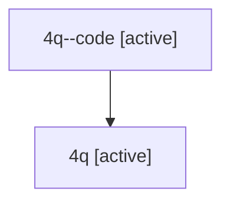

# Family: 4q

Owner: `bbugyi200.athena` · Hood: `4q` · Members: 2

## Lineage

The diagram is an optional enhancement; the ordered table below contains the same lineage in accessible text.

| Role | Agent | State | Model / provider | Timing | Commits | Prompt | Chat |
|---|---|---|---|---|---:|---|---|
| code | 4q--code | active | gpt-5.6-sol / codex | 2026-07-10T19:47:04.317633+00:00 | 0 | — | — |
| root | 4q | active | gpt-5.6-sol / codex | 2026-07-10T19:40:29.039971+00:00 | 1 | [Prompt](../agents/bbugyi200.athena.4q/prompt.md) | [Chat](../agents/bbugyi200.athena.4q/chat.md) |
