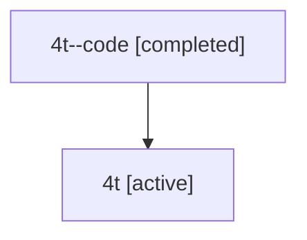

# Family: 4t

[Agent Hoods](../README.md) / [bbugyi200](../users/bbugyi200/README.md) / [athena](../users/bbugyi200/machines/athena/README.md) / [4t](../users/bbugyi200/machines/athena/hoods/4t/README.md) / 4t

Owner: `bbugyi200.athena` · Hood: `4t` · Members: 2

## Lineage

The diagram is an optional enhancement; the ordered table below contains the same lineage in accessible text.

| Role | Agent | State | Model / provider | Timing | Commits | Prompt | Chat |
|---|---|---|---|---|---:|---|---|
| code | 4t--code | completed | gpt-5.6-sol / codex | 2026-07-10T20:19:56.635101+00:00 | [1](../agents/bbugyi200.athena.4t--code/README.md#commits) | — | [Chat](../agents/bbugyi200.athena.4t--code/chat.md) |
| root | 4t | active | opus / claude | 2026-07-10T20:13:36.296395+00:00 | 0 | [Prompt](../agents/bbugyi200.athena.4t/prompt.md) | [Chat](../agents/bbugyi200.athena.4t/chat.md) |

## Commits

| Role | Repo | Commit | Subject | Committed |
|---|---|---|---|---|
| — | sase | [`cb30d6f`](https://github.com/sase-org/sase/commit/cb30d6ff56ab0757c5a21771c132a069260db7aa) | chore: Add SDD prompt and plan for worker\_model | 2026-06-09 20:36:50 EDT |
| code | sase | [`887f689`](https://github.com/sase-org/sase/commit/887f6890ce0323ec5608c940196ba2b76270b520) | fix: retry model capacity failures | 2026-07-10 16:25:53 EDT |
