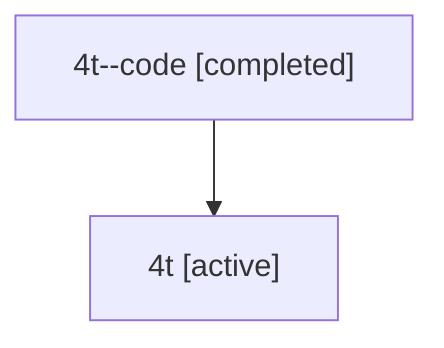

# Family: 4t

Owner: `bbugyi200.athena` · Hood: `4t` · Members: 2

## Lineage

The diagram is an optional enhancement; the ordered table below contains the same lineage in accessible text.

| Role | Agent | State | Model / provider | Timing | Commits | Prompt | Chat |
|---|---|---|---|---|---:|---|---|
| code | 4t--code | completed | gpt-5.6-sol / codex | 2026-07-10T20:19:56.635101+00:00 | 0 | — | [Chat](../agents/bbugyi200.athena.4t--code/chat.md) |
| root | 4t | active | opus / claude | 2026-07-10T20:13:36.296395+00:00 | 2 | [Prompt](../agents/bbugyi200.athena.4t/prompt.md) | [Chat](../agents/bbugyi200.athena.4t/chat.md) |
