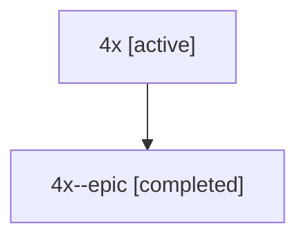

# Family: 4x

[Agent Hoods](../README.md) / [bbugyi200](../users/bbugyi200/README.md) / [athena](../users/bbugyi200/machines/athena/README.md) / [4x](../users/bbugyi200/machines/athena/hoods/4x/README.md) / 4x

Owner: `bbugyi200.athena` · Hood: `4x` · Members: 2

## Lineage

The diagram is an optional enhancement; the ordered table below contains the same lineage in accessible text.

| Role | Agent | State | Model / provider | Timing | Commits | Prompt | Chat |
|---|---|---|---|---|---:|---|---|
| root | 4x | active | claude-fable-5 / claude | 2026-07-10T20:36:56.269822+00:00 | [1](../agents/bbugyi200.athena.4x/README.md#commits) | [Prompt](../agents/bbugyi200.athena.4x/prompt.md) | [Chat](../agents/bbugyi200.athena.4x/chat.md) |
| epic | 4x--epic | completed | gpt-5.6-sol / codex | 2026-07-10T20:56:49.447307+00:00 | 0 | — | [Chat](../agents/bbugyi200.athena.4x--epic/chat.md) |

## Commits

| Role | Repo | Commit | Subject | Committed |
|---|---|---|---|---|
| root | sase | [`9fca688`](https://github.com/sase-org/sase/commit/9fca688f05e014dac3732251ede35bcacdbe680d) | chore: Add SDD prompt and plan for atomic\_starting\_count\_and\_row | 2026-06-10 09:03:09 EDT |

## Neighbors

| Agent | Relation | State |
|---|---|---|
| [4x--epic.f-0](../agents/bbugyi200.athena.4x--epic.f-0/README.md) | descendant | waiting |
