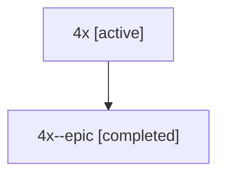

# Family: 4x

Owner: `bbugyi200.athena` · Hood: `4x` · Members: 2

## Lineage

The diagram is an optional enhancement; the ordered table below contains the same lineage in accessible text.

| Role | Agent | State | Model / provider | Timing | Commits | Prompt | Chat |
|---|---|---|---|---|---:|---|---|
| root | 4x | active | claude-fable-5 / claude | 2026-07-10T20:36:56.269822+00:00 | 1 | [Prompt](../agents/bbugyi200.athena.4x/prompt.md) | [Chat](../agents/bbugyi200.athena.4x/chat.md) |
| epic | 4x--epic | completed | gpt-5.6-sol / codex | 2026-07-10T20:56:49.447307+00:00 | 0 | — | [Chat](../agents/bbugyi200.athena.4x--epic/chat.md) |
