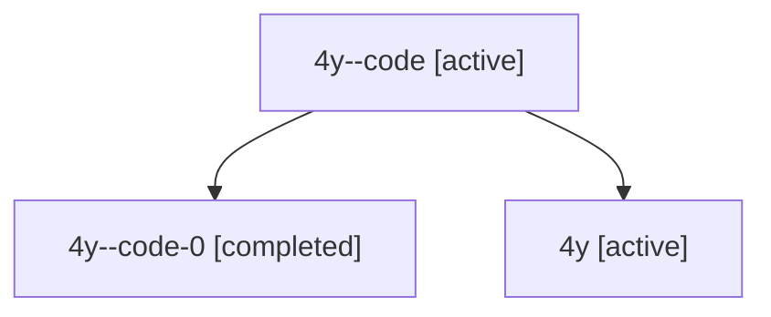

# Family: 4y

[Agent Hoods](../README.md) / [bbugyi200](../users/bbugyi200/README.md) / [athena](../users/bbugyi200/machines/athena/README.md) / [4y](../users/bbugyi200/machines/athena/hoods/4y/README.md) / 4y

Owner: `bbugyi200.athena` · Hood: `4y` · Members: 3

## Lineage

The diagram is an optional enhancement; the ordered table below contains the same lineage in accessible text.

| Role | Agent | State | Model / provider | Timing | Commits | Prompt | Chat |
|---|---|---|---|---|---:|---|---|
| code | 4y--code | active | gpt-5.6-sol / codex | 2026-07-10T21:08:54.714444+00:00 | 0 | — | [Chat](../agents/bbugyi200.athena.4y--code/chat.md) |
| code-0 | 4y--code-0 | completed | gpt-5.6-sol / codex | 2026-07-10T21:10:04.916924+00:00 | [1](../agents/bbugyi200.athena.4y--code-0/README.md#commits) | — | [Chat](../agents/bbugyi200.athena.4y--code-0/chat.md) |
| root | 4y | active | claude-fable-5 / claude | 2026-07-10T20:52:13.010169+00:00 | 0 | [Prompt](../agents/bbugyi200.athena.4y/prompt.md) | [Chat](../agents/bbugyi200.athena.4y/chat.md) |

## Commits

| Role | Repo | Commit | Subject | Committed |
|---|---|---|---|---|
| — | sase | [`7c7a5c6`](https://github.com/sase-org/sase/commit/7c7a5c6a48298ffd2eab7787abce943ef38b4ed2) | feat: add Claude Fable 5 model metadata | 2026-06-10 12:44:19 UTC |
| code-0 | sase | [`a262729`](https://github.com/sase-org/sase/commit/a2627294293db6ac85b0273cec6b5730a7a38a10) | feat(workspaces)!: scope linked repos to host workspaces | 2026-07-10 21:36:56 UTC |
