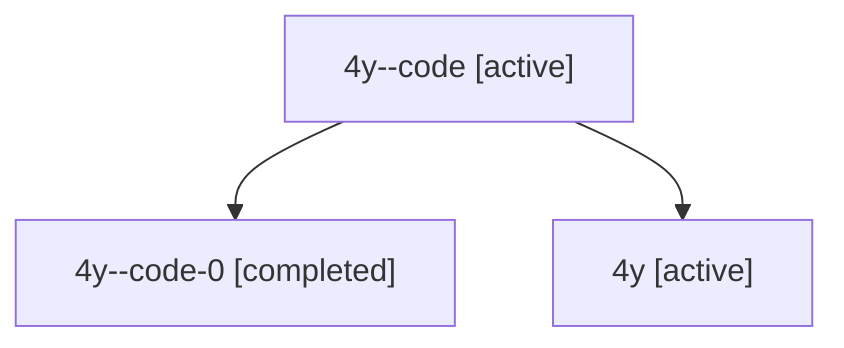

# Family: 4y

Owner: `bbugyi200.athena` · Hood: `4y` · Members: 3

## Lineage

The diagram is an optional enhancement; the ordered table below contains the same lineage in accessible text.

| Role | Agent | State | Model / provider | Timing | Commits | Prompt | Chat |
|---|---|---|---|---|---:|---|---|
| code | 4y--code | active | gpt-5.6-sol / codex | 2026-07-10T21:08:54.714444+00:00 | 0 | — | [Chat](../agents/bbugyi200.athena.4y--code/chat.md) |
| code-0 | 4y--code-0 | completed | gpt-5.6-sol / codex | 2026-07-10T21:10:04.916924+00:00 | 0 | — | [Chat](../agents/bbugyi200.athena.4y--code-0/chat.md) |
| root | 4y | active | claude-fable-5 / claude | 2026-07-10T20:52:13.010169+00:00 | 2 | [Prompt](../agents/bbugyi200.athena.4y/prompt.md) | [Chat](../agents/bbugyi200.athena.4y/chat.md) |
