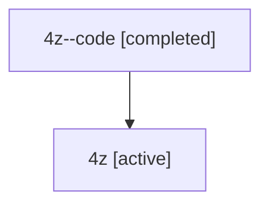

# Family: 4z

Owner: `bbugyi200.athena` · Hood: `4z` · Members: 2

## Lineage

The diagram is an optional enhancement; the ordered table below contains the same lineage in accessible text.

| Role | Agent | State | Model / provider | Timing | Commits | Prompt | Chat |
|---|---|---|---|---|---:|---|---|
| code | 4z--code | completed | gpt-5.6-sol / codex | 2026-07-10T21:49:39.071762+00:00 | 0 | — | [Chat](../agents/bbugyi200.athena.4z--code/chat.md) |
| root | 4z | active | gpt-5.6-sol / codex | 2026-07-10T21:45:06.475680+00:00 | 1 | [Prompt](../agents/bbugyi200.athena.4z/prompt.md) | [Chat](../agents/bbugyi200.athena.4z/chat.md) |
