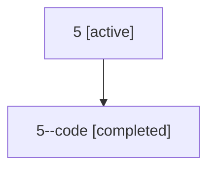

# Family: 5

[Agent Hoods](../README.md) / [bbugyi200](../users/bbugyi200/README.md) / [athena](../users/bbugyi200/machines/athena/README.md) / [5](../users/bbugyi200/machines/athena/hoods/5/README.md) / 5

Owner: `bbugyi200.athena` · Hood: `5` · Members: 2

## Lineage

The diagram is an optional enhancement; the ordered table below contains the same lineage in accessible text.

| Role | Agent | State | Model / provider | Timing | Commits | Prompt | Chat |
|---|---|---|---|---|---:|---|---|
| root | 5 | active | gpt-5.5 / codex | 2026-07-06T14:43:34.125063+00:00 | [1](../agents/bbugyi200.athena.5/README.md#commits) | [Prompt](../agents/bbugyi200.athena.5/prompt.md) | [Chat](../agents/bbugyi200.athena.5/chat.md) |
| code | 5--code | completed | opus / claude | 2026-07-06T14:46:12.883206+00:00 | [1](../agents/bbugyi200.athena.5--code/README.md#commits) | — | [Chat](../agents/bbugyi200.athena.5--code/chat.md) |

## Commits

| Role | Repo | Commit | Subject | Committed |
|---|---|---|---|---|
| — | sase | [`b846fb4`](https://github.com/sase-org/sase/commit/b846fb451f1cbe32ed4bf869b5796e0af8964556) | chore: Add SDD prompt and plan for vcs\_prefill\_display\_names | 2026-07-03 06:53:23 EDT |
| root | sase | [`2ff2381`](https://github.com/sase-org/sase/commit/2ff238114b384cc1ee5b1e9d755cc037c922eb0e) | chore: Add SDD prompt and plan for move\_consumed\_plan | 2026-07-06 10:46:11 EDT |
| code | sase | [`8585d19`](https://github.com/sase-org/sase/commit/8585d194d6bd805a79dcdf08820e5df7ce48177b) | feat: move consumed plan files into archive on propose | 2026-07-06 10:59:54 EDT |
