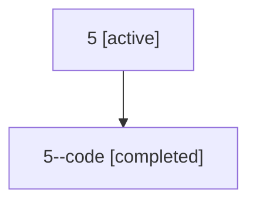

# Family: 5

Owner: `bbugyi200.athena` · Hood: `5` · Members: 2

## Lineage

The diagram is an optional enhancement; the ordered table below contains the same lineage in accessible text.

| Role | Agent | State | Model / provider | Timing | Commits | Prompt | Chat |
|---|---|---|---|---|---:|---|---|
| root | 5 | active | gpt-5.5 / codex | 2026-07-06T14:43:34.125063+00:00 | 3 | [Prompt](../agents/bbugyi200.athena.5/prompt.md) | [Chat](../agents/bbugyi200.athena.5/chat.md) |
| code | 5--code | completed | opus / claude | 2026-07-06T14:46:12.883206+00:00 | 0 | — | [Chat](../agents/bbugyi200.athena.5--code/chat.md) |
