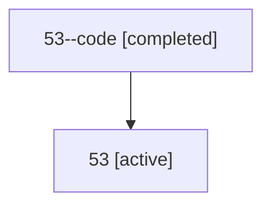

# Family: 53

[Agent Hoods](../README.md) / [bbugyi200](../users/bbugyi200/README.md) / [athena](../users/bbugyi200/machines/athena/README.md) / [53](../users/bbugyi200/machines/athena/hoods/53/README.md) / 53

Owner: `bbugyi200.athena` · Hood: `53` · Members: 2

## Lineage

The diagram is an optional enhancement; the ordered table below contains the same lineage in accessible text.

| Role | Agent | State | Model / provider | Timing | Commits | Prompt | Chat |
|---|---|---|---|---|---:|---|---|
| code | 53--code | completed | gpt-5.6-sol / codex | 2026-07-10T22:54:58.532868+00:00 | 0 | — | [Chat](../agents/bbugyi200.athena.53--code/chat.md) |
| root | 53 | active | gpt-5.6-sol / codex | 2026-07-10T22:51:02.604756+00:00 | [3](../agents/bbugyi200.athena.53/README.md#commits) | [Prompt](../agents/bbugyi200.athena.53/prompt.md) | [Chat](../agents/bbugyi200.athena.53/chat.md) |

## Commits

| Role | Repo | Commit | Subject | Committed (UTC) |
|---|---|---|---|---|
| root | sase | [`3dfd443`](https://github.com/sase-org/sase/commit/3dfd443764d2f0a52765961bc86e0401649a07dc) | chore: Add SDD prompt and plan for worker\_model\_handoffs | 2026-06-10 13:22:51 |
| root | sase | [`6a680c1`](https://github.com/sase-org/sase/commit/6a680c1fd3ed2614e6d85290ed7537e0ad844f24) | feat: route plan-implementation handoffs through the worker model lane | 2026-06-10 13:41:53 |
| root | sase | [`8ee7fa5`](https://github.com/sase-org/sase/commit/8ee7fa57d2ca5e2e63c051ef50dd3e82cb8aef1a) | feat(memory)!: require explicit project opt-in | 2026-07-10 23:12:38 |

## Neighbors

| Agent | Relation | State |
|---|---|---|
| [53.f-0](../agents/bbugyi200.athena.53.f-0/README.md) | descendant | active |
