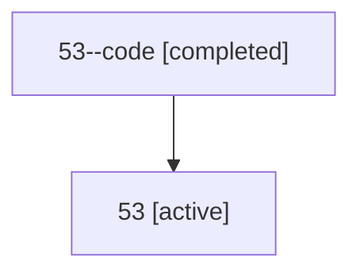

# Family: 53

Owner: `bbugyi200.athena` · Hood: `53` · Members: 2

## Lineage

The diagram is an optional enhancement; the ordered table below contains the same lineage in accessible text.

| Role | Agent | State | Model / provider | Timing | Commits | Prompt | Chat |
|---|---|---|---|---|---:|---|---|
| code | 53--code | completed | gpt-5.6-sol / codex | 2026-07-10T22:54:58.532868+00:00 | 0 | — | [Chat](../agents/bbugyi200.athena.53--code/chat.md) |
| root | 53 | active | gpt-5.6-sol / codex | 2026-07-10T22:51:02.604756+00:00 | 3 | [Prompt](../agents/bbugyi200.athena.53/prompt.md) | [Chat](../agents/bbugyi200.athena.53/chat.md) |
