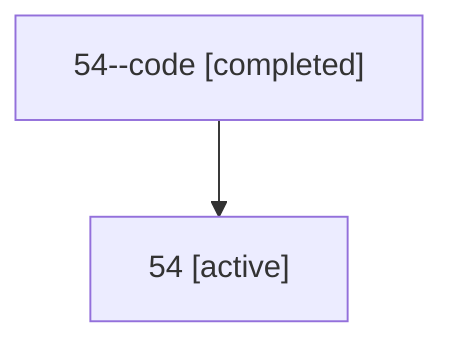

# Family: 54

Owner: `bbugyi200.athena` · Hood: `54` · Members: 2

## Lineage

The diagram is an optional enhancement; the ordered table below contains the same lineage in accessible text.

| Role | Agent | State | Model / provider | Timing | Commits | Prompt | Chat |
|---|---|---|---|---|---:|---|---|
| code | 54--code | completed | gpt-5.6-sol / codex | 2026-07-10T23:09:49.161396+00:00 | 1 | — | [Chat](../agents/bbugyi200.athena.54--code/chat.md) |
| root | 54 | active | claude-fable-5 / claude | 2026-07-10T22:58:30.457523+00:00 | 2 | [Prompt](../agents/bbugyi200.athena.54/prompt.md) | [Chat](../agents/bbugyi200.athena.54/chat.md) |
