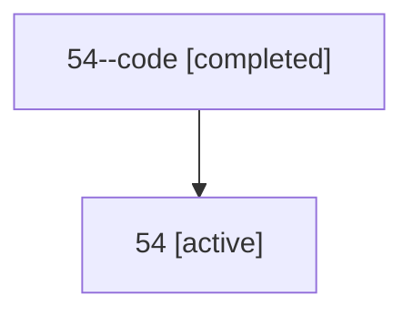

# Family: 54

[Agent Hoods](../README.md) / [bbugyi200](../users/bbugyi200/README.md) / [athena](../users/bbugyi200/machines/athena/README.md) / [54](../users/bbugyi200/machines/athena/hoods/54/README.md) / 54

Owner: `bbugyi200.athena` · Hood: `54` · Members: 2

## Lineage

The diagram is an optional enhancement; the ordered table below contains the same lineage in accessible text.

| Role | Agent | State | Model / provider | Timing | Commits | Prompt | Chat |
|---|---|---|---|---|---:|---|---|
| code | 54--code | completed | gpt-5.6-sol / codex | 2026-07-10T23:09:49.161396+00:00 | [1](../agents/bbugyi200.athena.54--code/README.md#commits) | — | [Chat](../agents/bbugyi200.athena.54--code/chat.md) |
| root | 54 | active | claude-fable-5 / claude | 2026-07-10T22:58:30.457523+00:00 | 0 | [Prompt](../agents/bbugyi200.athena.54/prompt.md) | [Chat](../agents/bbugyi200.athena.54/chat.md) |

## Commits

| Role | Repo | Commit | Subject | Committed |
|---|---|---|---|---|
| — | sase | [`a87a52b`](https://github.com/sase-org/sase/commit/a87a52bf08e2bf3fce533e2ef603a906b6751a99) | chore: Add SDD prompt and plan for xprompt\_lsp\_default\_xprompts | 2026-06-10 13:25:31 UTC |
| code | sase | [`7776f7a`](https://github.com/sase-org/sase/commit/7776f7a85726f3e05ea6b0fd135ee9b65cd1b1cb) | feat(ace): add inline xprompt property editing | 2026-07-11 00:16:46 UTC |
