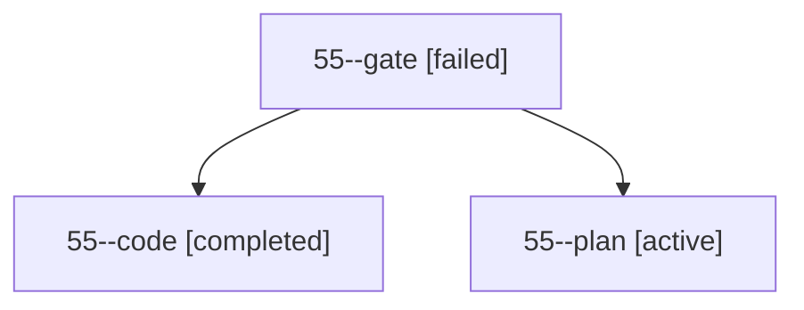

# Family: 55

[Agent Hoods](../README.md) / [bbugyi200](../users/bbugyi200/README.md) / [athena](../users/bbugyi200/machines/athena/README.md) / [55](../users/bbugyi200/machines/athena/hoods/55/README.md) / 55

Owner: `bbugyi200.athena` · Hood: `55` · Members: 3

## Lineage

The diagram is an optional enhancement; the ordered table below contains the same lineage in accessible text.

| Role | Agent | State | Model / provider | Timing | Commits | Prompt | Chat |
|---|---|---|---|---|---:|---|---|
| gate | 55--gate | failed | gpt-5.6-sol / codex | 2026-09-13T19:12:53.343304+00:00 → 2026-09-13T19:14:38.622878+00:00 | 0 | — | [Chat](../agents/bbugyi200.athena.55--gate/chat.md) |
| code | 55--code | completed | grok-4.6 / grok | 2026-09-13T19:14:54.851690+00:00 → 2026-09-13T20:56:34.551717+00:00 | [1](../agents/bbugyi200.athena.55--code/README.md#commits) | [Prompt](../agents/bbugyi200.athena.55--code/prompt.md) | [Chat](../agents/bbugyi200.athena.55--code/chat.md) |
| plan | 55--plan | active | gpt-5.6-sol / codex | 2026-09-13T19:02:28.644951+00:00 | 0 | [Prompt](../agents/bbugyi200.athena.55--plan/prompt.md) | [Chat](../agents/bbugyi200.athena.55--plan/chat.md) |

## Commits

| Role | Repo | Commit | Subject | Committed |
|---|---|---|---|---|
| — | sase | [`e2ce6f7`](https://github.com/sase-org/sase/commit/e2ce6f7288dba4f7d9680a7fab3badd20525fccf) | chore: Add SDD prompt and plan for root\_row\_multi\_provider\_icons | 2026-06-10 10:24:18 EDT |
| — | sase | [`f36a4b5`](https://github.com/sase-org/sase/commit/f36a4b56f33eb6e88b7c62d9772943084940abc9) | feat: show all row provider badges | 2026-06-10 10:32:18 EDT |
| code | sase | [`5be4f6a`](https://github.com/sase-org/sase/commit/5be4f6ae32e187170bf014f86322d735845a865f) | feat(ace): swap Agents r/R so r refreshes and R retries | 2026-09-13 16:52:59 EDT |

## Neighbors

| Agent | Relation | State |
|---|---|---|
| [55.w2](../agents/bbugyi200.athena.55.w2/README.md) | descendant | completed |
