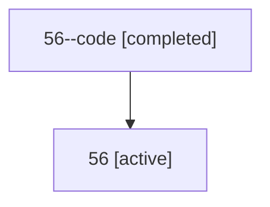

# Family: 56

[Agent Hoods](../README.md) / [bbugyi200](../users/bbugyi200/README.md) / [athena](../users/bbugyi200/machines/athena/README.md) / [56](../users/bbugyi200/machines/athena/hoods/56/README.md) / 56

Owner: `bbugyi200.athena` · Hood: `56` · Members: 2

## Lineage

The diagram is an optional enhancement; the ordered table below contains the same lineage in accessible text.

| Role | Agent | State | Model / provider | Timing | Commits | Prompt | Chat |
|---|---|---|---|---|---:|---|---|
| code | 56--code | completed | gpt-5.6-sol / codex | 2026-07-10T23:26:15.388474+00:00 | 0 | — | [Chat](../agents/bbugyi200.athena.56--code/chat.md) |
| root | 56 | active | claude-fable-5 / claude | 2026-07-10T23:17:23.738223+00:00 | [1](../agents/bbugyi200.athena.56/README.md#commits) | [Prompt](../agents/bbugyi200.athena.56/prompt.md) | [Chat](../agents/bbugyi200.athena.56/chat.md) |

## Commits

| Role | Repo | Commit | Subject | Committed (UTC) |
|---|---|---|---|---|
| root | sase | [`4067411`](https://github.com/sase-org/sase/commit/4067411bc5dd51a0e9ab8ea2cc1f601e9883ad1b) | fix: attribute SDD artifacts to the completing agent | 2026-07-10 23:34:56 |
