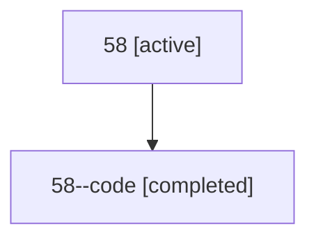

# Family: 58

[Agent Hoods](../README.md) / [bbugyi200](../users/bbugyi200/README.md) / [athena](../users/bbugyi200/machines/athena/README.md) / [58](../users/bbugyi200/machines/athena/hoods/58/README.md) / 58

Owner: `bbugyi200.athena` · Hood: `58` · Members: 2

## Lineage

The diagram is an optional enhancement; the ordered table below contains the same lineage in accessible text.

| Role | Agent | State | Model / provider | Timing | Commits | Prompt | Chat |
|---|---|---|---|---|---:|---|---|
| root | 58 | active | gpt-5.6-sol / codex | 2026-07-10T23:28:43.880120+00:00 | [1](../agents/bbugyi200.athena.58/README.md#commits) | [Prompt](../agents/bbugyi200.athena.58/prompt.md) | [Chat](../agents/bbugyi200.athena.58/chat.md) |
| code | 58--code | completed | gpt-5.6-sol / codex | 2026-07-10T23:32:51.905115+00:00 | 0 | — | [Chat](../agents/bbugyi200.athena.58--code/chat.md) |

## Commits

| Role | Commit | Subject | Committed (UTC) |
|---|---|---|---|
| root | [`78e0676`](https://github.com/sase-org/sase/commit/78e0676ad36e1b7266d3495df9ce99a751764ae0) | feat(init): initialize all active projects | 2026-07-10 23:46:15 |
