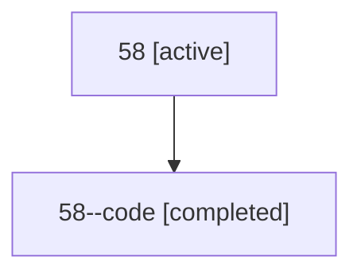

# Family: 58

Owner: `bbugyi200.athena` · Hood: `58` · Members: 2

## Lineage

The diagram is an optional enhancement; the ordered table below contains the same lineage in accessible text.

| Role | Agent | State | Model / provider | Timing | Commits | Prompt | Chat |
|---|---|---|---|---|---:|---|---|
| root | 58 | active | gpt-5.6-sol / codex | 2026-07-10T23:28:43.880120+00:00 | 1 | [Prompt](../agents/bbugyi200.athena.58/prompt.md) | [Chat](../agents/bbugyi200.athena.58/chat.md) |
| code | 58--code | completed | gpt-5.6-sol / codex | 2026-07-10T23:32:51.905115+00:00 | 0 | — | [Chat](../agents/bbugyi200.athena.58--code/chat.md) |
