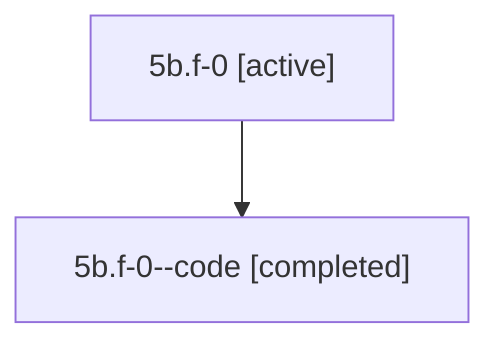

# Family: 5b.f-0

[Agent Hoods](../README.md) / [bbugyi200](../users/bbugyi200/README.md) / [athena](../users/bbugyi200/machines/athena/README.md) / [5b](../users/bbugyi200/machines/athena/hoods/5b/README.md) / 5b.f-0

Owner: `bbugyi200.athena` · Hood: `5b` · Members: 2

## Lineage

The diagram is an optional enhancement; the ordered table below contains the same lineage in accessible text.

| Role | Agent | State | Model / provider | Timing | Commits | Prompt | Chat |
|---|---|---|---|---|---:|---|---|
| root | 5b.f-0 | active | gpt-5.6-sol / codex | 2026-07-11T12:30:06.551519+00:00 | [1](../agents/bbugyi200.athena.5b.f-0/README.md#commits) | [Prompt](../agents/bbugyi200.athena.5b.f-0/prompt.md) | [Chat](../agents/bbugyi200.athena.5b.f-0/chat.md) |
| code | 5b.f-0--code | completed | gpt-5.6-sol / codex | 2026-07-11T12:36:05.538399+00:00 | 0 | — | [Chat](../agents/bbugyi200.athena.5b.f-0--code/chat.md) |

## Commits

| Role | Repo | Commit | Subject | Committed |
|---|---|---|---|---|
| root | sase | [`47d0066`](https://github.com/sase-org/sase/commit/47d0066bd77795d50e225290fb5a915895d23752) | feat(sdd)!: require confirmation for GitHub companion creation | 2026-07-11 08:55:38 EDT |

## Neighbors

| Agent | Relation | State |
|---|---|---|
| [5b](bbugyi200.athena.5b.md) (family · 2) | ancestor | active 1, completed 1 |
| [5b.f-0.w-0](bbugyi200.athena.5b.f-0.w-0.md) (family · 2) | descendant | active 1, completed 1 |
