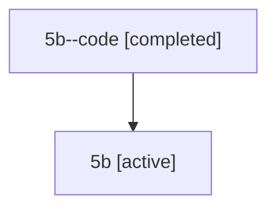

# Family: 5b

Owner: `bbugyi200.athena` · Hood: `5b` · Members: 2

## Lineage

The diagram is an optional enhancement; the ordered table below contains the same lineage in accessible text.

| Role | Agent | State | Model / provider | Timing | Commits | Prompt | Chat |
|---|---|---|---|---|---:|---|---|
| code | 5b--code | completed | gpt-5.6-sol / codex | 2026-07-11T12:10:44.013604+00:00 | 0 | — | [Chat](../agents/bbugyi200.athena.5b--code/chat.md) |
| root | 5b | active | gpt-5.6-sol / codex | 2026-07-11T12:06:34.111775+00:00 | 1 | [Prompt](../agents/bbugyi200.athena.5b/prompt.md) | [Chat](../agents/bbugyi200.athena.5b/chat.md) |
