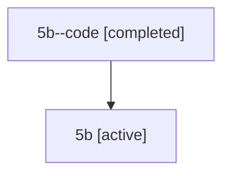

# Family: 5b

[Agent Hoods](../README.md) / [bbugyi200](../users/bbugyi200/README.md) / [athena](../users/bbugyi200/machines/athena/README.md) / [5b](../users/bbugyi200/machines/athena/hoods/5b/README.md) / 5b

Owner: `bbugyi200.athena` · Hood: `5b` · Members: 2

## Lineage

The diagram is an optional enhancement; the ordered table below contains the same lineage in accessible text.

| Role | Agent | State | Model / provider | Timing | Commits | Prompt | Chat |
|---|---|---|---|---|---:|---|---|
| code | 5b--code | completed | gpt-5.6-sol / codex | 2026-07-11T12:10:44.013604+00:00 | [1](../agents/bbugyi200.athena.5b--code/README.md#commits) | — | [Chat](../agents/bbugyi200.athena.5b--code/chat.md) |
| root | 5b | active | gpt-5.6-sol / codex | 2026-07-11T12:06:34.111775+00:00 | 0 | [Prompt](../agents/bbugyi200.athena.5b/prompt.md) | [Chat](../agents/bbugyi200.athena.5b/chat.md) |

## Commits

| Role | Repo | Commit | Subject | Committed |
|---|---|---|---|---|
| code | sase | [`7657ed4`](https://github.com/sase-org/sase/commit/7657ed44435ac830f41728e0f9244538440743bc) | feat!: require explicit SASE project management authorization | 2026-07-11 12:29:32 UTC |

## Neighbors

| Agent | Relation | State |
|---|---|---|
| [5b.f-0](bbugyi200.athena.5b.f-0.md) (family · 2) | descendant | active 1, completed 1 |
| [5b.f-0.w-0](bbugyi200.athena.5b.f-0.w-0.md) (family · 2) | descendant | active 1, completed 1 |
