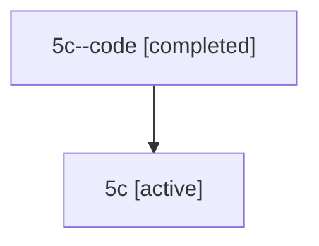

# Family: 5c

[Agent Hoods](../README.md) / [bbugyi200](../users/bbugyi200/README.md) / [athena](../users/bbugyi200/machines/athena/README.md) / [5c](../users/bbugyi200/machines/athena/hoods/5c/README.md) / 5c

Owner: `bbugyi200.athena` · Hood: `5c` · Members: 2

## Lineage

The diagram is an optional enhancement; the ordered table below contains the same lineage in accessible text.

| Role | Agent | State | Model / provider | Timing | Commits | Prompt | Chat |
|---|---|---|---|---|---:|---|---|
| code | 5c--code | completed | gpt-5.6-sol / codex | 2026-07-11T12:14:41.566448+00:00 | 0 | — | [Chat](../agents/bbugyi200.athena.5c--code/chat.md) |
| root | 5c | active | gpt-5.6-sol / codex | 2026-07-11T12:11:12.866025+00:00 | [1](../agents/bbugyi200.athena.5c/README.md#commits) | [Prompt](../agents/bbugyi200.athena.5c/prompt.md) | [Chat](../agents/bbugyi200.athena.5c/chat.md) |

## Commits

| Role | Repo | Commit | Subject | Committed |
|---|---|---|---|---|
| root | sase | [`4f87e3e`](https://github.com/sase-org/sase/commit/4f87e3e022dc15d20b96f3aa0df04b659dcec8fc) | feat!: add phased commit hooks | 2026-07-11 08:33:38 EDT |
