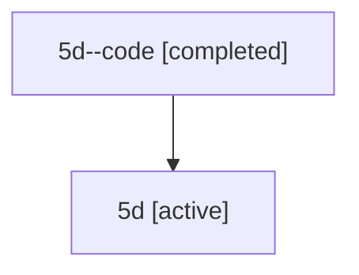

# Family: 5d

[Agent Hoods](../README.md) / [bbugyi200](../users/bbugyi200/README.md) / [athena](../users/bbugyi200/machines/athena/README.md) / [5d](../users/bbugyi200/machines/athena/hoods/5d/README.md) / 5d

Owner: `bbugyi200.athena` · Hood: `5d` · Members: 2

## Lineage

The diagram is an optional enhancement; the ordered table below contains the same lineage in accessible text.

| Role | Agent | State | Model / provider | Timing | Commits | Prompt | Chat |
|---|---|---|---|---|---:|---|---|
| code | 5d--code | completed | gpt-5.6-sol / codex | 2026-07-11T12:32:45.661165+00:00 | [1](../agents/bbugyi200.athena.5d--code/README.md#commits) | — | [Chat](../agents/bbugyi200.athena.5d--code/chat.md) |
| root | 5d | active | claude-fable-5 / claude | 2026-07-11T12:24:44.306626+00:00 | [1](../agents/bbugyi200.athena.5d/README.md#commits) | [Prompt](../agents/bbugyi200.athena.5d/prompt.md) | [Chat](../agents/bbugyi200.athena.5d/chat.md) |

## Commits

| Role | Repo | Commit | Subject | Committed |
|---|---|---|---|---|
| code | sase | [`5605178`](https://github.com/sase-org/sase/commit/56051782c1ac46bf44720f6ee27f47bc685443a2) | fix: attribute nested linked repository commits correctly | 2026-07-11 08:39:04 EDT |
| root | sase | [`5605178`](https://github.com/sase-org/sase/commit/56051782c1ac46bf44720f6ee27f47bc685443a2) | fix: attribute nested linked repository commits correctly | 2026-07-11 08:39:04 EDT |
