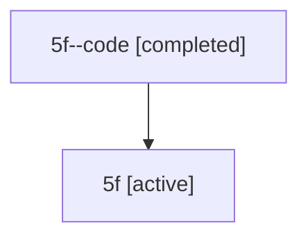

# Family: 5f

[Agent Hoods](../README.md) / [bbugyi200](../users/bbugyi200/README.md) / [athena](../users/bbugyi200/machines/athena/README.md) / [5f](../users/bbugyi200/machines/athena/hoods/5f/README.md) / 5f

Owner: `bbugyi200.athena` · Hood: `5f` · Members: 2

## Lineage

The diagram is an optional enhancement; the ordered table below contains the same lineage in accessible text.

| Role | Agent | State | Model / provider | Timing | Commits | Prompt | Chat |
|---|---|---|---|---|---:|---|---|
| code | 5f--code | completed | gpt-5.6-sol / codex | 2026-07-11T13:04:34.482217+00:00 | 0 | — | [Chat](../agents/bbugyi200.athena.5f--code/chat.md) |
| root | 5f | active | claude-fable-5 / claude | 2026-07-11T12:49:56.393294+00:00 | [1](../agents/bbugyi200.athena.5f/README.md#commits) | [Prompt](../agents/bbugyi200.athena.5f/prompt.md) | [Chat](../agents/bbugyi200.athena.5f/chat.md) |

## Commits

| Role | Repo | Commit | Subject | Committed |
|---|---|---|---|---|
| root | sase | [`1064f1d`](https://github.com/sase-org/sase/commit/1064f1df38ce7c73354c8f42375e5d74cba98da8) | fix: finalize interrupted tool calls on agent teardown | 2026-07-11 09:14:45 EDT |
