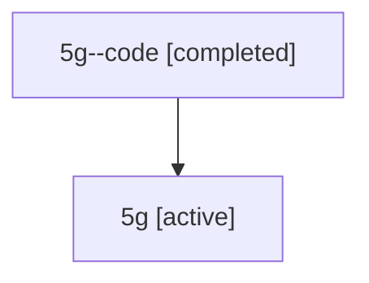

# Family: 5g

[Agent Hoods](../README.md) / [bbugyi200](../users/bbugyi200/README.md) / [athena](../users/bbugyi200/machines/athena/README.md) / [5g](../users/bbugyi200/machines/athena/hoods/5g/README.md) / 5g

Owner: `bbugyi200.athena` · Hood: `5g` · Members: 2

## Lineage

The diagram is an optional enhancement; the ordered table below contains the same lineage in accessible text.

| Role | Agent | State | Model / provider | Timing | Commits | Prompt | Chat |
|---|---|---|---|---|---:|---|---|
| code | 5g--code | completed | gpt-5.6-sol / codex | 2026-07-11T13:11:13.593324+00:00 | [1](../agents/bbugyi200.athena.5g--code/README.md#commits) | — | [Chat](../agents/bbugyi200.athena.5g--code/chat.md) |
| root | 5g | active | opus / claude | 2026-07-11T13:01:44.963663+00:00 | [1](../agents/bbugyi200.athena.5g/README.md#commits) | [Prompt](../agents/bbugyi200.athena.5g/prompt.md) | [Chat](../agents/bbugyi200.athena.5g/chat.md) |

## Commits

| Role | Repo | Commit | Subject | Committed |
|---|---|---|---|---|
| code | sase | [`1654299`](https://github.com/sase-org/sase/commit/1654299f0297286883d6802e52c070546214c50d) | feat(ace): add model alias buckets | 2026-07-11 09:32:57 EDT |
| root | sase | [`1654299`](https://github.com/sase-org/sase/commit/1654299f0297286883d6802e52c070546214c50d) | feat(ace): add model alias buckets | 2026-07-11 09:32:57 EDT |

## Neighbors

| Agent | Relation | State |
|---|---|---|
| [5g.f-0](bbugyi200.athena.5g.f-0.md) (family · 2) | descendant | active 1, completed 1 |
| [5g.f-0.f-0](bbugyi200.athena.5g.f-0.f-0.md) (family · 2) | descendant | active 1, completed 1 |
