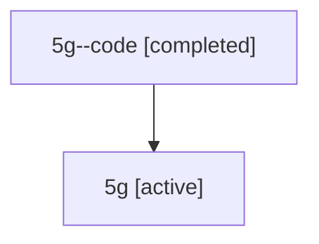

# Family: 5g

Owner: `bbugyi200.athena` · Hood: `5g` · Members: 2

## Lineage

The diagram is an optional enhancement; the ordered table below contains the same lineage in accessible text.

| Role | Agent | State | Model / provider | Timing | Commits | Prompt | Chat |
|---|---|---|---|---|---:|---|---|
| code | 5g--code | completed | gpt-5.6-sol / codex | 2026-07-11T13:11:13.593324+00:00 | 1 | — | [Chat](../agents/bbugyi200.athena.5g--code/chat.md) |
| root | 5g | active | opus / claude | 2026-07-11T13:01:44.963663+00:00 | 1 | [Prompt](../agents/bbugyi200.athena.5g/prompt.md) | [Chat](../agents/bbugyi200.athena.5g/chat.md) |
