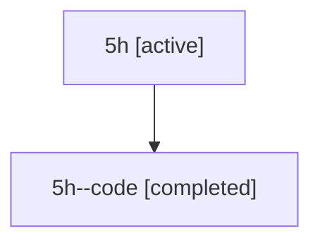

# Family: 5h

[Agent Hoods](../README.md) / [bbugyi200](../users/bbugyi200/README.md) / [athena](../users/bbugyi200/machines/athena/README.md) / [5h](../users/bbugyi200/machines/athena/hoods/5h/README.md) / 5h

Owner: `bbugyi200.athena` · Hood: `5h` · Members: 2

## Lineage

The diagram is an optional enhancement; the ordered table below contains the same lineage in accessible text.

| Role | Agent | State | Model / provider | Timing | Commits | Prompt | Chat |
|---|---|---|---|---|---:|---|---|
| root | 5h | active | claude-fable-5 / claude | 2026-07-11T13:15:54.437809+00:00 | [1](../agents/bbugyi200.athena.5h/README.md#commits) | [Prompt](../agents/bbugyi200.athena.5h/prompt.md) | [Chat](../agents/bbugyi200.athena.5h/chat.md) |
| code | 5h--code | completed | gpt-5.6-sol / codex | 2026-07-11T13:25:09.859707+00:00 | 0 | — | [Chat](../agents/bbugyi200.athena.5h--code/chat.md) |

## Commits

| Role | Repo | Commit | Subject | Committed |
|---|---|---|---|---|
| root | sase | [`3d23bdd`](https://github.com/sase-org/sase/commit/3d23bdd9b6f2cdedf3340b76cd2e0984b14dc847) | fix: preserve SASE plan tags for separate stores | 2026-07-11 09:36:34 EDT |
