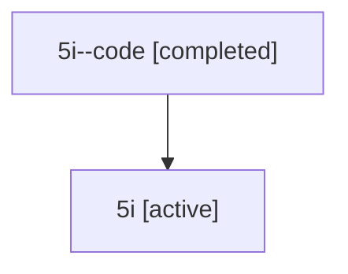

# Family: 5i

Owner: `bbugyi200.athena` · Hood: `5i` · Members: 2

## Lineage

The diagram is an optional enhancement; the ordered table below contains the same lineage in accessible text.

| Role | Agent | State | Model / provider | Timing | Commits | Prompt | Chat |
|---|---|---|---|---|---:|---|---|
| code | 5i--code | completed | gpt-5.6-sol / codex | 2026-07-11T13:50:59.635221+00:00 | 0 | — | [Chat](../agents/bbugyi200.athena.5i--code/chat.md) |
| root | 5i | active | gpt-5.6-sol / codex | 2026-07-11T13:45:08.395902+00:00 | 1 | [Prompt](../agents/bbugyi200.athena.5i/prompt.md) | [Chat](../agents/bbugyi200.athena.5i/chat.md) |
