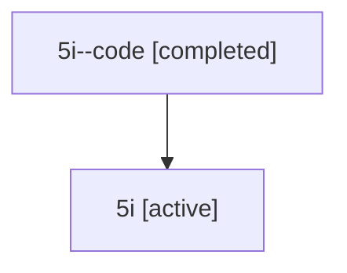

# Family: 5i

[Agent Hoods](../README.md) / [bbugyi200](../users/bbugyi200/README.md) / [athena](../users/bbugyi200/machines/athena/README.md) / [5i](../users/bbugyi200/machines/athena/hoods/5i/README.md) / 5i

Owner: `bbugyi200.athena` · Hood: `5i` · Members: 2

## Lineage

The diagram is an optional enhancement; the ordered table below contains the same lineage in accessible text.

| Role | Agent | State | Model / provider | Timing | Commits | Prompt | Chat |
|---|---|---|---|---|---:|---|---|
| code | 5i--code | completed | gpt-5.6-sol / codex | 2026-07-11T13:50:59.635221+00:00 | [1](../agents/bbugyi200.athena.5i--code/README.md#commits) | — | [Chat](../agents/bbugyi200.athena.5i--code/chat.md) |
| root | 5i | active | gpt-5.6-sol / codex | 2026-07-11T13:45:08.395902+00:00 | 0 | [Prompt](../agents/bbugyi200.athena.5i/prompt.md) | [Chat](../agents/bbugyi200.athena.5i/chat.md) |

## Commits

| Role | Repo | Commit | Subject | Committed |
|---|---|---|---|---|
| code | sase | [`2e7ed4d`](https://github.com/sase-org/sase/commit/2e7ed4d869ebc88046dc8dd247c74dcacf3a2173) | fix(tui): widen models panel content | 2026-07-11 14:00:04 UTC |

## Neighbors

| Agent | Relation | State |
|---|---|---|
| [5i.w-0](bbugyi200.athena.5i.w-0.md) (family · 2) | descendant | active 1, completed 1 |
