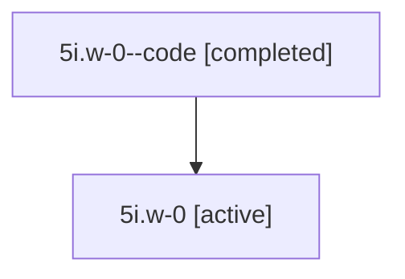

# Family: 5i.w-0

[Agent Hoods](../README.md) / [bbugyi200](../users/bbugyi200/README.md) / [athena](../users/bbugyi200/machines/athena/README.md) / [5i](../users/bbugyi200/machines/athena/hoods/5i/README.md) / 5i.w-0

Owner: `bbugyi200.athena` · Hood: `5i` · Members: 2

## Lineage

The diagram is an optional enhancement; the ordered table below contains the same lineage in accessible text.

| Role | Agent | State | Model / provider | Timing | Commits | Prompt | Chat |
|---|---|---|---|---|---:|---|---|
| code | 5i.w-0--code | completed | gpt-5.6-sol / codex | 2026-07-11T14:06:37.714703+00:00 | 0 | — | [Chat](../agents/bbugyi200.athena.5i.w-0--code/chat.md) |
| root | 5i.w-0 | active | gpt-5.6-sol / codex | 2026-07-11T14:01:01.043355+00:00 | [1](../agents/bbugyi200.athena.5i.w-0/README.md#commits) | [Prompt](../agents/bbugyi200.athena.5i.w-0/prompt.md) | [Chat](../agents/bbugyi200.athena.5i.w-0/chat.md) |

## Commits

| Role | Commit | Subject | Committed (UTC) |
|---|---|---|---|
| root | [`ed7714b`](https://github.com/sase-org/sase/commit/ed7714b5b2e5f714cd54105139b054e28c7a8fb7) | feat(models): group coder aliases in built-in bucket | 2026-07-11 14:25:50 |

## Neighbors

| Agent | Relation | State |
|---|---|---|
| [5i](bbugyi200.athena.5i.md) (family · 2) | ancestor | active 1, completed 1 |
