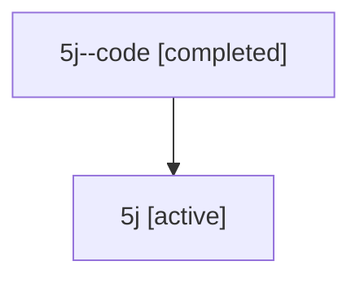

# Family: 5j

[Agent Hoods](../README.md) / [bbugyi200](../users/bbugyi200/README.md) / [athena](../users/bbugyi200/machines/athena/README.md) / [5j](../users/bbugyi200/machines/athena/hoods/5j/README.md) / 5j

Owner: `bbugyi200.athena` · Hood: `5j` · Members: 2

## Lineage

The diagram is an optional enhancement; the ordered table below contains the same lineage in accessible text.

| Role | Agent | State | Model / provider | Timing | Commits | Prompt | Chat |
|---|---|---|---|---|---:|---|---|
| code | 5j--code | completed | gpt-5.6-sol / codex | 2026-07-11T13:59:40.383696+00:00 | 0 | — | [Chat](../agents/bbugyi200.athena.5j--code/chat.md) |
| root | 5j | active | gpt-5.6-sol / codex | 2026-07-11T13:55:24.995559+00:00 | [1](../agents/bbugyi200.athena.5j/README.md#commits) | [Prompt](../agents/bbugyi200.athena.5j/prompt.md) | [Chat](../agents/bbugyi200.athena.5j/chat.md) |

## Commits

| Role | Repo | Commit | Subject | Committed (UTC) |
|---|---|---|---|---|
| root | sase | [`f6f0224`](https://github.com/sase-org/sase/commit/f6f02240fed6e4f6435469b4de016f81e39788b0) | fix(memory): fold agent doc source changes into init commits | 2026-07-11 14:11:48 |
