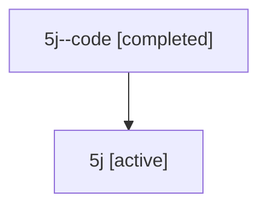

# Family: 5j

Owner: `bbugyi200.athena` · Hood: `5j` · Members: 2

## Lineage

The diagram is an optional enhancement; the ordered table below contains the same lineage in accessible text.

| Role | Agent | State | Model / provider | Timing | Commits | Prompt | Chat |
|---|---|---|---|---|---:|---|---|
| code | 5j--code | completed | gpt-5.6-sol / codex | 2026-07-11T13:59:40.383696+00:00 | 0 | — | [Chat](../agents/bbugyi200.athena.5j--code/chat.md) |
| root | 5j | active | gpt-5.6-sol / codex | 2026-07-11T13:55:24.995559+00:00 | 1 | [Prompt](../agents/bbugyi200.athena.5j/prompt.md) | [Chat](../agents/bbugyi200.athena.5j/chat.md) |
