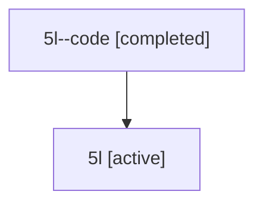

# Family: 5l

Owner: `bbugyi200.athena` · Hood: `5l` · Members: 2

## Lineage

The diagram is an optional enhancement; the ordered table below contains the same lineage in accessible text.

| Role | Agent | State | Model / provider | Timing | Commits | Prompt | Chat |
|---|---|---|---|---|---:|---|---|
| code | 5l--code | completed | gpt-5.6-sol / codex | 2026-07-11T15:41:31.188438+00:00 | 0 | — | [Chat](../agents/bbugyi200.athena.5l--code/chat.md) |
| root | 5l | active | gpt-5.6-sol / codex | 2026-07-11T15:33:08.121786+00:00 | 2 | [Prompt](../agents/bbugyi200.athena.5l/prompt.md) | [Chat](../agents/bbugyi200.athena.5l/chat.md) |
