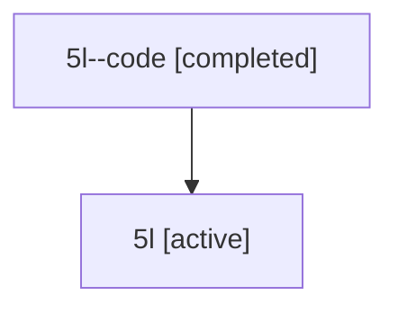

# Family: 5l

[Agent Hoods](../README.md) / [bbugyi200](../users/bbugyi200/README.md) / [athena](../users/bbugyi200/machines/athena/README.md) / [5l](../users/bbugyi200/machines/athena/hoods/5l/README.md) / 5l

Owner: `bbugyi200.athena` · Hood: `5l` · Members: 2

## Lineage

The diagram is an optional enhancement; the ordered table below contains the same lineage in accessible text.

| Role | Agent | State | Model / provider | Timing | Commits | Prompt | Chat |
|---|---|---|---|---|---:|---|---|
| code | 5l--code | completed | gpt-5.6-sol / codex | 2026-07-11T15:41:31.188438+00:00 | 0 | — | [Chat](../agents/bbugyi200.athena.5l--code/chat.md) |
| root | 5l | active | gpt-5.6-sol / codex | 2026-07-11T15:33:08.121786+00:00 | [2](../agents/bbugyi200.athena.5l/README.md#commits) | [Prompt](../agents/bbugyi200.athena.5l/prompt.md) | [Chat](../agents/bbugyi200.athena.5l/chat.md) |

## Commits

| Role | Repo | Commit | Subject | Committed (UTC) |
|---|---|---|---|---|
| root | sase | [`93c8ccb`](https://github.com/sase-org/sase/commit/93c8ccb35bd197a082269dc107cae7696fac6b04) | fix: resolve 11 bugs found in recent-commit audit (cb7a4a556..690d4a3be) (#167) | 2026-06-12 12:15:05 |
| root | sase | [`1c0154b`](https://github.com/sase-org/sase/commit/1c0154b904984bb6c3b5475c499030426775094f) | fix: make workflow retries independent of workspace helper | 2026-07-11 15:57:47 |

## Neighbors

| Agent | Relation | State |
|---|---|---|
| [5l.w-0](../agents/bbugyi200.athena.5l.w-0/README.md) | descendant | active |
