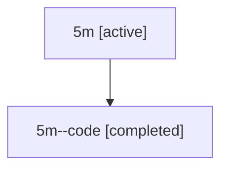

# Family: 5m

Owner: `bbugyi200.athena` · Hood: `5m` · Members: 2

## Lineage

The diagram is an optional enhancement; the ordered table below contains the same lineage in accessible text.

| Role | Agent | State | Model / provider | Timing | Commits | Prompt | Chat |
|---|---|---|---|---|---:|---|---|
| root | 5m | active | gpt-5.6-sol / codex | 2026-07-11T16:26:57.232421+00:00 | 1 | [Prompt](../agents/bbugyi200.athena.5m/prompt.md) | [Chat](../agents/bbugyi200.athena.5m/chat.md) |
| code | 5m--code | completed | gpt-5.6-sol / codex | 2026-07-11T16:32:26.887749+00:00 | 0 | — | [Chat](../agents/bbugyi200.athena.5m--code/chat.md) |
