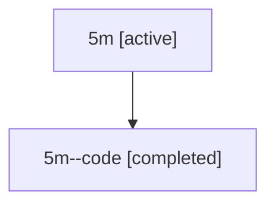

# Family: 5m

[Agent Hoods](../README.md) / [bbugyi200](../users/bbugyi200/README.md) / [athena](../users/bbugyi200/machines/athena/README.md) / [5m](../users/bbugyi200/machines/athena/hoods/5m/README.md) / 5m

Owner: `bbugyi200.athena` · Hood: `5m` · Members: 2

## Lineage

The diagram is an optional enhancement; the ordered table below contains the same lineage in accessible text.

| Role | Agent | State | Model / provider | Timing | Commits | Prompt | Chat |
|---|---|---|---|---|---:|---|---|
| root | 5m | active | gpt-5.6-sol / codex | 2026-07-11T16:26:57.232421+00:00 | 0 | [Prompt](../agents/bbugyi200.athena.5m/prompt.md) | [Chat](../agents/bbugyi200.athena.5m/chat.md) |
| code | 5m--code | completed | gpt-5.6-sol / codex | 2026-07-11T16:32:26.887749+00:00 | [1](../agents/bbugyi200.athena.5m--code/README.md#commits) | — | [Chat](../agents/bbugyi200.athena.5m--code/chat.md) |

## Commits

| Role | Repo | Commit | Subject | Committed |
|---|---|---|---|---|
| code | sase | [`94d7cdc`](https://github.com/sase-org/sase/commit/94d7cdc48c43a7e6cd2c9472b3c3b69ca443497a) | perf(tui): reuse update freshness for confirmation | 2026-07-11 12:44:09 EDT |
