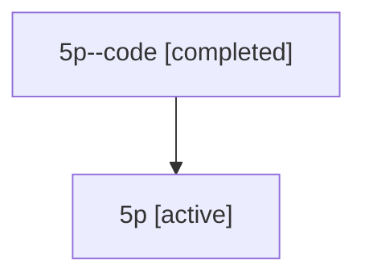

# Family: 5p

[Agent Hoods](../README.md) / [bbugyi200](../users/bbugyi200/README.md) / [athena](../users/bbugyi200/machines/athena/README.md) / [5p](../users/bbugyi200/machines/athena/hoods/5p/README.md) / 5p

Owner: `bbugyi200.athena` · Hood: `5p` · Members: 2

## Lineage

The diagram is an optional enhancement; the ordered table below contains the same lineage in accessible text.

| Role | Agent | State | Model / provider | Timing | Commits | Prompt | Chat |
|---|---|---|---|---|---:|---|---|
| code | 5p--code | completed | gpt-5.6-sol / codex | 2026-07-11T16:42:13.007747+00:00 | [1](../agents/bbugyi200.athena.5p--code/README.md#commits) | — | [Chat](../agents/bbugyi200.athena.5p--code/chat.md) |
| root | 5p | active | gpt-5.6-sol / codex | 2026-07-11T16:33:51.764708+00:00 | [1](../agents/bbugyi200.athena.5p/README.md#commits) | [Prompt](../agents/bbugyi200.athena.5p/prompt.md) | [Chat](../agents/bbugyi200.athena.5p/chat.md) |

## Commits

| Role | Repo | Commit | Subject | Committed |
|---|---|---|---|---|
| code | sase | [`028ecae`](https://github.com/sase-org/sase/commit/028ecaea069c24c89dd2156106df60555d2cd2ec) | fix(tui): invalidate stale detail work before hint rendering | 2026-07-11 12:49:30 EDT |
| root | sase | [`028ecae`](https://github.com/sase-org/sase/commit/028ecaea069c24c89dd2156106df60555d2cd2ec) | fix(tui): invalidate stale detail work before hint rendering | 2026-07-11 12:49:30 EDT |
