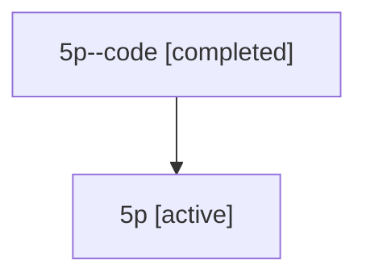

# Family: 5p

Owner: `bbugyi200.athena` · Hood: `5p` · Members: 2

## Lineage

The diagram is an optional enhancement; the ordered table below contains the same lineage in accessible text.

| Role | Agent | State | Model / provider | Timing | Commits | Prompt | Chat |
|---|---|---|---|---|---:|---|---|
| code | 5p--code | completed | gpt-5.6-sol / codex | 2026-07-11T16:42:13.007747+00:00 | 1 | — | [Chat](../agents/bbugyi200.athena.5p--code/chat.md) |
| root | 5p | active | gpt-5.6-sol / codex | 2026-07-11T16:33:51.764708+00:00 | 1 | [Prompt](../agents/bbugyi200.athena.5p/prompt.md) | [Chat](../agents/bbugyi200.athena.5p/chat.md) |
