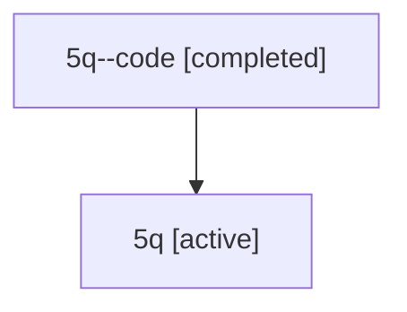

# Family: 5q

Owner: `bbugyi200.athena` · Hood: `5q` · Members: 2

## Lineage

The diagram is an optional enhancement; the ordered table below contains the same lineage in accessible text.

| Role | Agent | State | Model / provider | Timing | Commits | Prompt | Chat |
|---|---|---|---|---|---:|---|---|
| code | 5q--code | completed | gpt-5.6-sol / codex | 2026-07-11T16:45:14.764004+00:00 | 0 | — | [Chat](../agents/bbugyi200.athena.5q--code/chat.md) |
| root | 5q | active | opus / claude | 2026-07-11T16:37:19.176927+00:00 | 3 | [Prompt](../agents/bbugyi200.athena.5q/prompt.md) | [Chat](../agents/bbugyi200.athena.5q/chat.md) |
