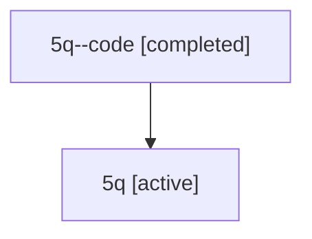

# Family: 5q

[Agent Hoods](../README.md) / [bbugyi200](../users/bbugyi200/README.md) / [athena](../users/bbugyi200/machines/athena/README.md) / [5q](../users/bbugyi200/machines/athena/hoods/5q/README.md) / 5q

Owner: `bbugyi200.athena` · Hood: `5q` · Members: 2

## Lineage

The diagram is an optional enhancement; the ordered table below contains the same lineage in accessible text.

| Role | Agent | State | Model / provider | Timing | Commits | Prompt | Chat |
|---|---|---|---|---|---:|---|---|
| code | 5q--code | completed | gpt-5.6-sol / codex | 2026-07-11T16:45:14.764004+00:00 | 0 | — | [Chat](../agents/bbugyi200.athena.5q--code/chat.md) |
| root | 5q | active | opus / claude | 2026-07-11T16:37:19.176927+00:00 | [3](../agents/bbugyi200.athena.5q/README.md#commits) | [Prompt](../agents/bbugyi200.athena.5q/prompt.md) | [Chat](../agents/bbugyi200.athena.5q/chat.md) |

## Commits

| Role | Repo | Commit | Subject | Committed (UTC) |
|---|---|---|---|---|
| root | sase | [`d6c4a5b`](https://github.com/sase-org/sase/commit/d6c4a5bd2e6951598758f6bf22ccf4d9a65ec260) | chore: Add SDD prompt and plan for commit\_tags | 2026-06-12 16:12:02 |
| root | sase | [`1d59abb`](https://github.com/sase-org/sase/commit/1d59abbcd27ccf52af8503f2c330ffe6b768f59f) | docs: expand git commit tag guidance | 2026-06-12 16:17:36 |
| root | sase | [`dc12217`](https://github.com/sase-org/sase/commit/dc1221799490b32d8c1939394dd502da83479f65) | feat(tui): distinguish artifact types with icons | 2026-07-11 17:01:50 |
