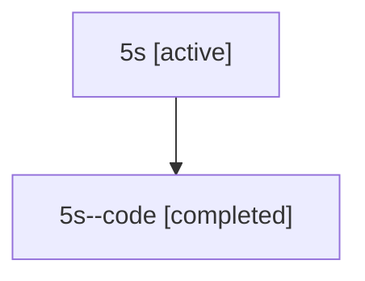

# Family: 5s

Owner: `bbugyi200.athena` · Hood: `5s` · Members: 2

## Lineage

The diagram is an optional enhancement; the ordered table below contains the same lineage in accessible text.

| Role | Agent | State | Model / provider | Timing | Commits | Prompt | Chat |
|---|---|---|---|---|---:|---|---|
| root | 5s | active | opus / claude | 2026-07-11T16:46:39.399585+00:00 | 3 | [Prompt](../agents/bbugyi200.athena.5s/prompt.md) | [Chat](../agents/bbugyi200.athena.5s/chat.md) |
| code | 5s--code | completed | gpt-5.6-sol / codex | 2026-07-11T16:55:28.137652+00:00 | 0 | — | [Chat](../agents/bbugyi200.athena.5s--code/chat.md) |
