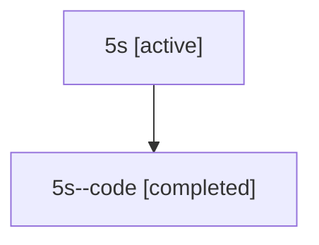

# Family: 5s

[Agent Hoods](../README.md) / [bbugyi200](../users/bbugyi200/README.md) / [athena](../users/bbugyi200/machines/athena/README.md) / [5s](../users/bbugyi200/machines/athena/hoods/5s/README.md) / 5s

Owner: `bbugyi200.athena` · Hood: `5s` · Members: 2

## Lineage

The diagram is an optional enhancement; the ordered table below contains the same lineage in accessible text.

| Role | Agent | State | Model / provider | Timing | Commits | Prompt | Chat |
|---|---|---|---|---|---:|---|---|
| root | 5s | active | opus / claude | 2026-07-11T16:46:39.399585+00:00 | 0 | [Prompt](../agents/bbugyi200.athena.5s/prompt.md) | [Chat](../agents/bbugyi200.athena.5s/chat.md) |
| code | 5s--code | completed | gpt-5.6-sol / codex | 2026-07-11T16:55:28.137652+00:00 | [1](../agents/bbugyi200.athena.5s--code/README.md#commits) | — | [Chat](../agents/bbugyi200.athena.5s--code/chat.md) |

## Commits

| Role | Repo | Commit | Subject | Committed |
|---|---|---|---|---|
| — | sase | [`72c8bed`](https://github.com/sase-org/sase/commit/72c8bed85ccc359a58f75ebc4f67e8fa75a29e39) | chore: Add SDD prompt and plan for vcs\_mru\_cycling\_anywhere | 2026-06-12 16:45:50 UTC |
| — | sase | [`d297e00`](https://github.com/sase-org/sase/commit/d297e000d1a043028cfa08d38008f51897adf5e6) | feat(ace): cycle VCS MRU prefixes in prompt bodies | 2026-06-12 17:05:17 UTC |
| code | sase | [`59ea6e5`](https://github.com/sase-org/sase/commit/59ea6e53ec4207741f793cd61f9547cb3ae62e2e) | feat: show alias references in Models panel | 2026-07-11 17:03:21 UTC |
