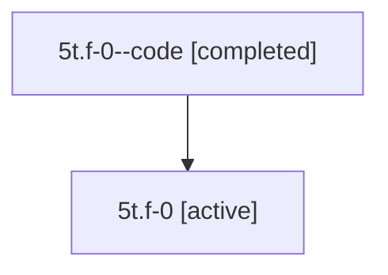

# Family: 5t.f-0

[Agent Hoods](../README.md) / [bbugyi200](../users/bbugyi200/README.md) / [athena](../users/bbugyi200/machines/athena/README.md) / [5t](../users/bbugyi200/machines/athena/hoods/5t/README.md) / 5t.f-0

Owner: `bbugyi200.athena` · Hood: `5t` · Members: 2

## Lineage

The diagram is an optional enhancement; the ordered table below contains the same lineage in accessible text.

| Role | Agent | State | Model / provider | Timing | Commits | Prompt | Chat |
|---|---|---|---|---|---:|---|---|
| code | 5t.f-0--code | completed | gpt-5.6-sol / codex | 2026-07-11T17:57:21.176779+00:00 | [1](../agents/bbugyi200.athena.5t.f-0--code/README.md#commits) | — | [Chat](../agents/bbugyi200.athena.5t.f-0--code/chat.md) |
| root | 5t.f-0 | active | claude-fable-5 / claude | 2026-07-11T17:44:51.877110+00:00 | [1](../agents/bbugyi200.athena.5t.f-0/README.md#commits) | [Prompt](../agents/bbugyi200.athena.5t.f-0/prompt.md) | [Chat](../agents/bbugyi200.athena.5t.f-0/chat.md) |

## Commits

| Role | Commit | Subject | Committed (UTC) |
|---|---|---|---|
| code | [`4376456`](https://github.com/sase-org/sase/commit/437645675ee74440a32fd4079fee031bbe3524f3) | fix: make retry visual tests hermetic | 2026-07-11 18:08:52 |
| root | [`4376456`](https://github.com/sase-org/sase/commit/437645675ee74440a32fd4079fee031bbe3524f3) | fix: make retry visual tests hermetic | 2026-07-11 18:08:52 |

## Neighbors

| Agent | Relation | State |
|---|---|---|
| [5t](../agents/bbugyi200.athena.5t/README.md) | ancestor | active |
